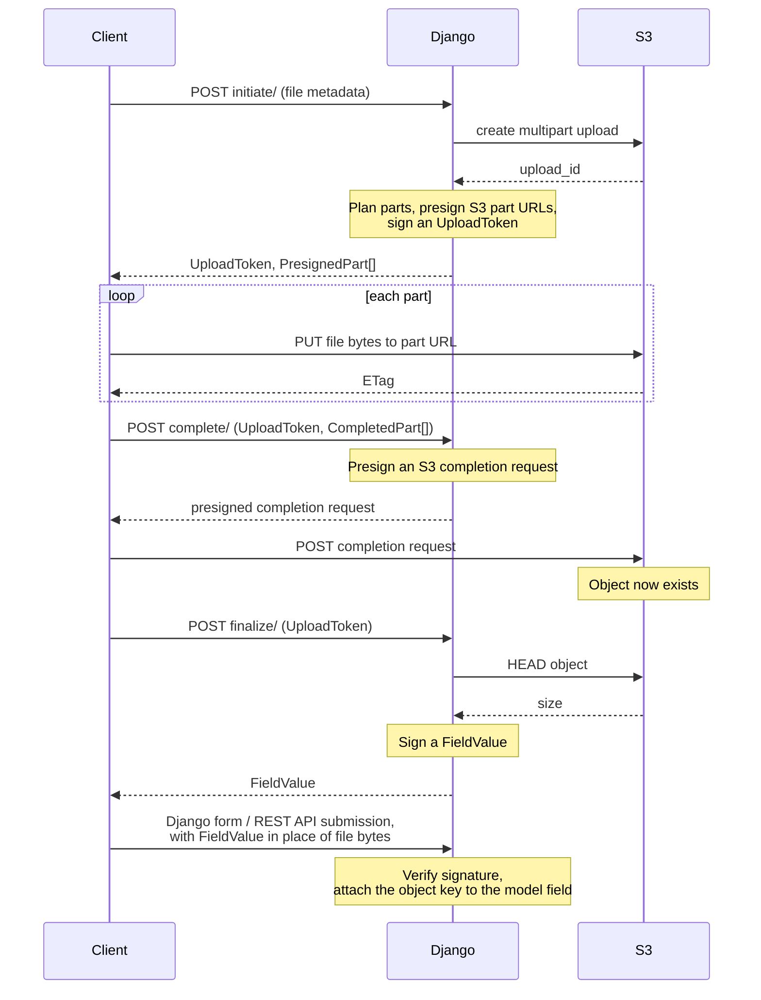

# Design

django-s3-file-field moves file content directly from an HTTP client to S3, without
proxying bytes through Django. For user-facing usage, see [README.md](../README.md); this
document is an internal briefing for developers of the library itself.

## The upload protocol

An upload is three requests to this library's endpoints, interleaved with direct
transfers to S3, then a final submission to the application itself:

`initiate` and `complete` bound the S3 multipart upload lifecycle (they presign S3's own
operations). `finalize` and the `FieldValue` submission relate the otherwise-orphaned S3
object back to a model in the database.

| Stage | Endpoint | Request → Response |
|---|---|---|
| `initiate` | `POST initiate/` | `InitiationRequest` → `InitiationResponse` |
| `complete` | `POST complete/` | `CompletionRequest` → `CompletionResponse` |
| `finalize` | `POST finalize/` | `FinalizationRequest` → `FinalizationResponse` |
| usage | any Django form / DRF endpoint | `FieldValue` → saved model instance |

## Design principles

- **Django never touches file bytes.** The server only issues presigned URLs and verifies
  outcomes; all content flows client → S3. Even `CompleteMultipartUpload` is presigned by
  the server and executed by the client.
- **An upload targets a specific `S3FileField` instance.** The initiation request
  identifies it by a stringified reference; that `S3FileField`'s options determine both
  the generated object key and the Django `Storage` used for every S3 interaction.
- **The server is stateless.** No database rows track in-flight uploads. All upload
  state (`field`, `upload_id`, `object_key`) travels in the `UploadToken`: a signed,
  timestamped, opaque string the client must return at subsequent stages. The final
  `field_value` is likewise a signed claim (`FieldValue`: `object_key`, `file_size`), so
  any later Django form or DRF serializer submission is verifiable without shared state.
- **The client is untrusted.** Every inbound payload is validated by a Pydantic model
  (`_schemas.py`); anything echoed back by the client is either signed (tokens) or
  strictly constrained (e.g. ETags, which are interpolated into the completion XML body).
- **`finalize` verifies, not trusts.** The `field_value` is only minted after a `HEAD`
  confirms the object actually exists in storage, with its size read from storage rather
  than from the client.
- **`FieldValue` stands in where the file would be.** A Django form or DRF serializer
  receives the signed `FieldValue` string as the submitted value for the file field, in
  place of file content. The Django form `S3FileInput` widget or DRF serializer
  `S3FileSerializerField` field verifies it and substitutes a placeholder file
  (`S3PlaceholderFile`), which is saved by Django as a simple string reference to the S3
  key, without needing to access S3.
- **Storage backends are pluggable.** `MultipartManager` is the S3-layer facade;
  `S3MultipartManager` (`django-storages`) and `MinioMultipartManager`
  (`django-minio-storage`) implement the storage-specific presigning. It is selected at
  request time from the field's Django `Storage`.
